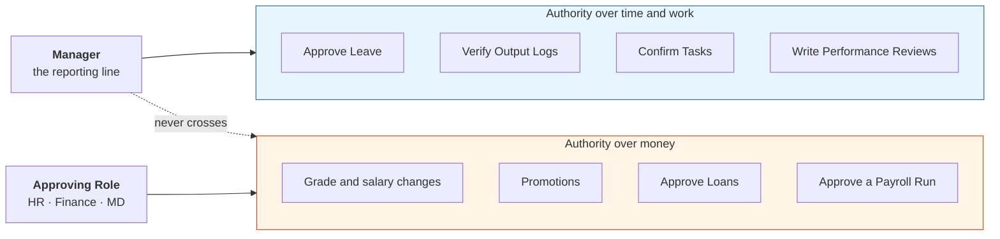
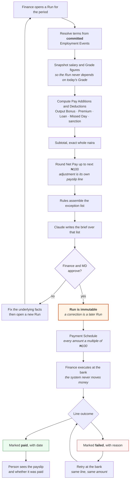
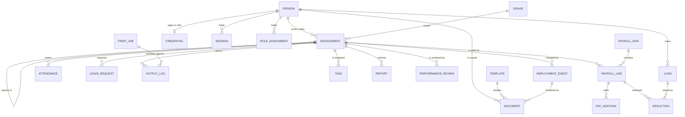
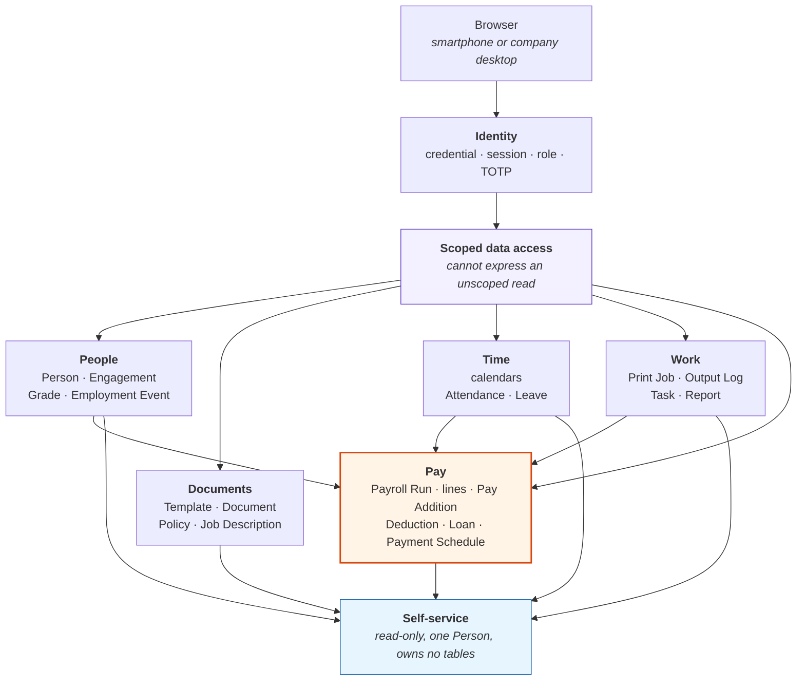
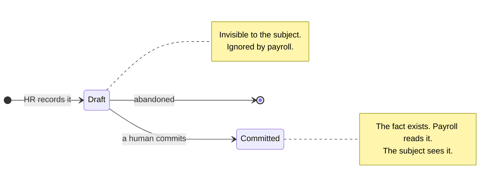
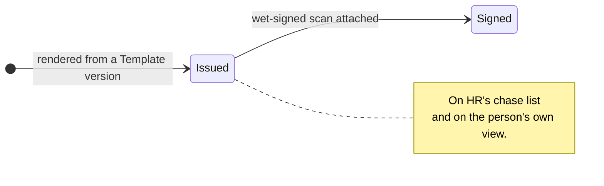
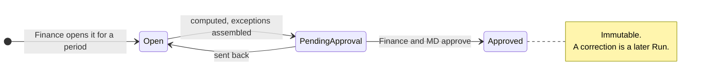
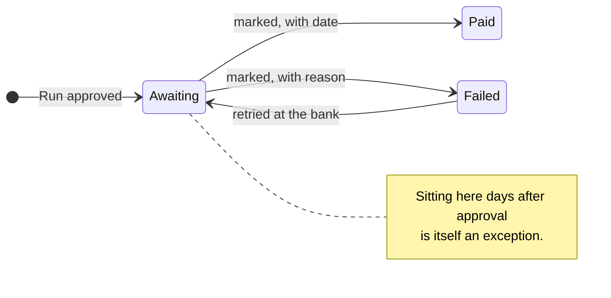

# Requirements: Talabon People Operations

What the system must do, who does it, and how the pieces fit.

This document is the functional spec.
It assumes the vocabulary in [`CONTEXT.md`](../CONTEXT.md) and does not redefine it, so a term in `Code Style` is a defined domain term rather than a table name.
The technology stack lives in [`architecture.md`](./architecture.md) and the AI features in [`ai-roadmap.md`](./ai-roadmap.md); neither is repeated here.
Decisions are recorded in [`adr/`](./adr/) and cited inline where they constrain a requirement.

**Scope.** The MVP covers `Permanent Engagement` only ([ADR 0010](./adr/0010-the-mvp-covers-permanent-engagements-only.md)).
Phase tags below are `P1` people and documents, `P2` attendance, leave, loans and payroll, `P3` print jobs, tasks, output and reports.

---

## 1. Actors

Authority splits two ways, and conflating them is the single most consequential mistake available in this system.
A `Manager` has authority over a person's **time and work**.
An `Approving Role` has authority over **money**.
Neither can act for the other, and the reporting line never confers a pay decision.

| Actor | Authority | Cannot |
|---|---|---|
| `Person` | Read their own record. Submit `Leave` requests, `Report`s, `Output Log` claims | See anyone else's record. Change their own terms, pay or phone number |
| `Manager` | Approve `Leave`, verify `Output Log`s, confirm `Task`s, write `Performance Review`s for their reports | Change pay, `Grade`, or anything a `Payroll Run` reads. Approve a `Loan` |
| HR | Onboard people, issue `Document`s, record `Employment Event`s, set and reset passwords, maintain `Template`s, `Policy`s and `Job Description`s | Approve a `Payroll Run` alone. Approve a `Loan` alone |
| Finance | Approve `Loan`s, approve a `Payroll Run`, execute the `Payment Schedule` and mark lines | Alter a `Grade` or salary unilaterally. Verify work they did not supervise |
| MD / Owner | Approve `Grade` and salary changes, promotions, and a `Payroll Run`. Read everything | Bypass the record. Change an approved `Payroll Run` |

One person may hold several Approving Roles at Talabon's size, which is a staffing reality rather than a reason to merge the roles in the model.
Recording them separately is what makes it possible to tighten later without a rewrite.

---

## 2. User stories

Stories carry IDs so flows, tests and later code can cite them.
Acceptance criteria are given where getting it wrong costs money or trust, and omitted where the story is self-evident.

### Access (`AUTH`)

**AUTH-1** `P1` As a `Person`, I sign in with my phone number and password, on my own smartphone or a company desktop, so that I can reach my own record.
- Phone number is the username, and it is unique across all `Person` records.
- Failure gives no hint whether the number or the password was wrong.
- Rate limited per phone number; Turnstile on the form.

**AUTH-2** `P1` As HR, I set a person's initial password in person at onboarding, so that nobody needs an SMS or email to get started ([ADR 0008](./adr/0008-login-depends-on-no-external-provider.md)).
- The person must change it on first sign-in.
- HR never sees an existing password, only sets a new one.

**AUTH-3** `P1` As HR, I reset a forgotten password in person, so that a lockout is solved at the HR desk rather than by a vendor.

**AUTH-4** `P1` As a holder of an `Approving Role`, I enrol an authenticator app, so that approving money needs something beyond a password.
- Required before the role can be exercised, not merely offered.
- TOTP rather than SMS, deliberately ([ADR 0008](./adr/0008-login-depends-on-no-external-provider.md)).

**AUTH-5** `P1` As HR, I revoke a person's sessions immediately when they exit, so that access ends with employment.

**AUTH-6** `P1` As a `Person` on a shared desktop, my session expires after a short idle period and there is no "keep me signed in", so that the next person at that machine cannot read my payslip.

**AUTH-7** `P1` As HR, I change a person's phone number only through a verified process, because the number is a credential and not ordinary contact data.

### People and terms (`PER`)

**PER-1** `P1` As HR, I create a `Person` with name, phone, photo, bank account, next of kin and guarantor, so that Talabon holds one durable record per human.
- Talabon deliberately holds no NIN.
- Bank account is held for the `Payment Schedule` and is verified by HR, not by the system.

**PER-2** `P1` As HR, I open an `Engagement` for a `Person` with job title, `Grade`, salary, reporting line, `Leave` entitlement and loan ceiling, so that their terms are explicit from day one.
- Salary must fall inside the `Grade`'s band.
- A `Person` may have at most one active `Engagement` at a time.
- `Leave` entitlement and loan ceiling are set per `Engagement`, not by `Grade`.

**PER-3** `P1` As HR, I end an `Engagement` with a reason and a last day, so that the record shows a clean boundary rather than a person going quiet.

**PER-4** `P1` As HR, I open a fresh `Engagement` for someone previously employed, so that a rehire is new terms rather than an edit to history.
- Their outstanding `Loan` follows them, because it belongs to the `Person`.

**PER-5** `P1` As MD, I maintain `Grade`s with their salary band, missed-day deduction and premium per non-`Expected Day`, so that pay rules are published rather than negotiated case by case.

### Employment events (`EVT`)

**EVT-1** `P1` As HR, I record an `Employment Event` (confirmation, promotion, `Grade` change, salary change, sanction, suspension, exit) against an `Engagement`, so that the fact exists independently of any letter.
- The event is the source of truth; a `Document` is rendered from it ([ADR 0004](./adr/0004-employment-events-are-primary.md)).
- A promotion changes what payroll pays whether or not a letter is ever printed.

**EVT-2** `P1` As MD or Finance, I approve events that change money before they take effect, so that the reporting line cannot grant a raise.

**EVT-3** `P1` As HR, I draft an event without it taking effect or becoming visible to its subject, so that something under consideration is not mistaken for something decided.
- A draft event is invisible to the `Person` and ignored by payroll.
- Committing it is the moment it becomes real ([ADR 0009](./adr/0009-a-person-sees-their-own-committed-record.md)).

**EVT-4** `P2` As a `Payroll Run`, I read only committed events effective on or before the period end, so that pay reflects decided facts and nothing else.

### Documents and reference material (`DOC`)

**DOC-1** `P1` As HR, I maintain versioned `Template`s for every letter and form Talabon issues, so that wording changes do not rewrite history.

**DOC-2** `P1` As HR, I issue a `Document` to a `Person` from a `Template`, so that the artifact records which `Template` version produced it.
- A letter issued years ago still reproduces exactly after the wording changes.
- Where the `Document` renders an `Employment Event`, it cites that event.

**DOC-3** `P1` As HR, I attach the wet-signed scan and move a `Document` from Issued to Signed, so that an unsigned NDA is visibly outstanding rather than silently missing.
- Only attaching a scan can make it Signed.
- The signed date is the date on the document, which may differ from the upload date.

**DOC-4** `P1` As HR, I see every outstanding unsigned `Document` across everyone, so that chasing paperwork is a list rather than a memory exercise.

**DOC-5** `P1` As HR, I have Claude read an uploaded scan and propose whether it is the document it claims to be, whether it carries a signature, and what date it bears, so that I review a proposal rather than typing from the page.
- The proposal never commits the transition; a human does ([ADR 0005](./adr/0005-ai-drafts-humans-commit.md)).
- This is the only AI feature in `P1`.

**DOC-6** `P1` As HR, I publish versioned `Policy` documents, being the staff policy and the SOP for an operation, scoped to everyone or to a `Grade` or job title.
- A `Policy` is published to a group and signed by nobody.
- Where proof of reading is needed, a `Document` is issued from it and signed in the ordinary way.

**DOC-7** `P1` As HR, I publish a versioned `Job Description` per job title, so that it changes when the role changes and not when the holder does.

### Self-service (`SELF`)

**SELF-1** `P1` As a `Person`, I see my own profile: name, phone, photo, bank account, next of kin and guarantor, so that I can tell HR what is wrong with it.
- Viewing is not editing. Corrections go through HR.

**SELF-2** `P1` As a `Person`, I see my current `Engagement` terms and my earlier ones as history, so that my record shows the terms things happened under rather than only today's ([ADR 0009](./adr/0009-a-person-sees-their-own-committed-record.md)).

**SELF-3** `P1` As a `Person`, I see which of my `Document`s are outstanding, so that I know what I still owe HR.

**SELF-4** `P1` As a `Person`, I read the `Job Description` for my title and the `Policy`s that apply to me, so that what is expected of me is available without asking.

**SELF-5** `P1` As a `Person`, I see my own committed `Employment Event`s and finalised `Performance Review`s, and never a draft of either.

**SELF-6** `P2` As a `Person`, I see my `Attendance` for the period with `Missed Day`s named as such, my `Leave` balance, and my outstanding `Loan`, so that I can challenge an error before payday rather than after.

**SELF-7** `P2` As a `Person`, I see each payslip itemised down to the rounding line, and whether that money has been marked paid ([ADR 0011](./adr/0011-a-payment-schedule-line-records-its-own-execution.md)).

**SELF-8** `P3` As a `Person`, I see my `Output Log` claims split into verified and awaiting my `Manager`, so that an unverified claim is visibly stuck rather than quietly lost.

### Time (`TIME`)

**TIME-1** `P2` As HR, I maintain the `Expected Day` calendar as Monday to Saturday minus Nigerian public holidays, so that deductions rest on a published calendar.
- An error here takes money off someone for a day they were never meant to work.

**TIME-2** `P2` As HR, I maintain the `Operating Day` calendar separately, including Sundays and public holidays, so that when work is *possible* never implies attendance was *required*.
- The two calendars must not be collapsed into one.

**TIME-3** `P2` As a `Manager`, I mark `Attendance` for every `Expected Day` for my reports, so that an unmarked day is a gap to chase rather than an assumed day of presence.

**TIME-4** `P2` As HR, I see unmarked `Attendance` days before payroll runs, so that gaps are closed rather than priced.

**TIME-5** `P2` As a `Person`, I request `Leave` for a date range, and as their `Manager` I approve or reject it.

**TIME-6** `P2` As the system, I treat approved absence beyond the entitlement as unpaid and therefore a `Missed Day`, so that approval and payment stay separate questions.

**TIME-7** `P2` As the system, I record a `Premium` for an `Operating Day` worked that is not an `Expected Day`, at the flat per-`Grade` amount that mirrors the `Missed Day` deduction.

### Pay (`PAY`)

**PAY-1** `P2` As Finance, I open a `Payroll Run` for a period covering the active `Engagement`s, so that pay is computed rather than assembled by hand.

**PAY-2** `P2` As the system, I compute `Net Pay` as salary plus `Pay Addition`s minus `Deduction`s, itemising every movement away from base salary.
- `Pay Addition` is currently an `Output Bonus` or a `Premium`.
- `Deduction` is a `Loan` repayment, a `Missed Day`, or a disciplinary sanction.
- Talabon withholds nothing statutory, so every `Deduction` traces to a specific Talabon decision ([ADR 0002](./adr/0002-payroll-withholds-nothing-and-moves-no-money.md)).

**PAY-3** `P2` As the system, I compute in whole naira and round only the final `Net Pay` up to the next ₦100, shown as its own payslip line ([ADR 0007](./adr/0007-money-is-whole-naira-net-pay-rounds-up-to-100.md)).
- Components stay exact, so the payslip adds up.
- The rounding line reads ₦0 rather than being omitted when the subtotal is already a multiple of ₦100.

**PAY-4** `P2` As the system, I store the figures a `Run` used rather than recomputing them later, so that editing a `Grade` today cannot change what an old payslip says.

**PAY-5** `P2` As Finance or MD, I review a pre-flight exception list before approving, so that approving is a decision rather than a rubber stamp.
- Unmarked `Attendance`, `Engagement`s with no `Grade`, `Loan`s that should have closed, unverified `Output Log`s, unsigned `Document`s, and figures that moved sharply since last period.
- Claude turns that rule-built list into a readable brief; the rules decide what is on it ([ADR 0005](./adr/0005-ai-drafts-humans-commit.md)).

**PAY-6** `P2` As Finance, I approve a `Run`, after which it is immutable and a correction is a later `Run` rather than an edit.

**PAY-7** `P2` As Finance, I take the approved `Payment Schedule` to the bank and mark each line paid or failed, so that the system records what happened and not only what it instructed ([ADR 0011](./adr/0011-a-payment-schedule-line-records-its-own-execution.md)).
- Marking execution never alters an amount.
- A failed line is retried, not re-run.

**PAY-8** `P2` As a `Person`, I request a `Loan`, and as Finance I approve it within the `Engagement`'s ceiling, so that lending is bounded and recorded.
- The outstanding balance belongs to the `Person` and survives their departure.
- Repayment is a `Deduction` in later `Run`s, and the balance reaches exactly zero because repayments are exact whole naira.

**PAY-9** `P2` As Finance, I see any `Payment Schedule` line still awaiting payment days after approval, so that the execution record does not quietly rot.

### Work and output (`WORK`)

**WORK-1** `P3` As a `Manager`, I record a `Print Job` with job number, description, quantity ordered, size, type and due date, so that output claims have something to be checked against.
- It holds nothing commercial: no customer, no price, no quote, no invoice ([ADR 0001](./adr/0001-people-operations-scope.md)).

**WORK-2** `P3` As a `Manager`, I have Claude parse a `Print Job` out of a WhatsApp message or phone note into structured fields for me to confirm, because that is how jobs actually arrive.

**WORK-3** `P3` As an operator, I log how much of a `Print Job` I produced, and as their `Manager` I verify it before it counts toward anything.
- Logged output across a `Print Job` cannot exceed quantity ordered plus a spoilage margin, which is what makes the claim falsifiable.

**WORK-4** `P3` As the system, I compute an `Output Bonus` from verified `Output Log` volume above a published threshold, so that it can be argued against the record rather than granted at discretion.

**WORK-5** `P3` As a `Manager`, I assign a `Task` and confirm it complete.
- In the MVP a `Task` carries no amount and has no pay effect ([ADR 0010](./adr/0010-the-mvp-covers-permanent-engagements-only.md)).

**WORK-6** `P3` As a `Person`, I submit a weekly or monthly `Report` pre-filled with my `Attendance`, `Task`s and `Output Log`s, supplying only the narrative the data cannot carry.

### Performance (`PERF`)

**PERF-1** `P3` As a `Manager`, I complete a twice-yearly `Performance Review` for a report, pre-filled with the period's `Attendance`, `Task`s and `Output Log`s.

**PERF-2** `P3` As the system, I treat a review as producing a recommendation only, so that any resulting pay change is a separate `Employment Event` approved by an `Approving Role`.

---

## 3. User flows

### 3.1 Onboard a permanent employee `P1`

| # | Actor | Step |
|---|---|---|
| 1 | HR | Create the `Person`: name, phone, photo, bank account, next of kin, guarantor |
| 2 | HR | Open an `Engagement`: job title, `Grade`, salary within band, reporting line, `Leave` entitlement, loan ceiling |
| 3 | HR | Record the offer `Employment Event` and issue the offer letter `Document` from its `Template` |
| 4 | HR | Issue the remaining `Document` set: NDA, non-compete, employee data form, guarantor form |
| 5 | HR | Set the initial password in person, flagged must-change |
| 6 | Person | Sign in, change password, read their `Job Description` and applicable `Policy`s |
| 7 | Person | Return wet-signed paperwork |
| 8 | HR | Upload each scan; Claude proposes type, signature and date; HR confirms Issued → Signed |

Exit condition: the `Engagement` is active and no `Document` is outstanding.
Until step 8 completes for every document, this person appears on HR's outstanding list and on the payroll pre-flight exception list.

### 3.2 Sign in `P1`

| # | Actor | Step |
|---|---|---|
| 1 | Person | Enter phone number and password; Turnstile runs |
| 2 | System | Verify against the stored hash; rate limit per phone number; reveal nothing about which field failed |
| 3 | System | If an `Approving Role` holder, demand the TOTP code |
| 4 | System | Create a session row with a short idle expiry and no persistent option |
| 5 | Person | Land on their own record |

### 3.3 Record a promotion `P1` `P2`

| # | Actor | Step |
|---|---|---|
| 1 | Manager | Recommend, via a `Performance Review` or directly. A recommendation is not a change |
| 2 | HR | Draft the promotion `Employment Event` with the new `Grade`, salary and effective date. Invisible to the subject while draft |
| 3 | MD | Approve, because this changes money and the reporting line cannot |
| 4 | HR | Commit the event. It now exists and the subject can see it |
| 5 | HR | Render the promotion letter `Document` from the event, optionally |
| 6 | Payroll | The next `Run` whose period covers the effective date pays the new salary, letter or no letter |

### 3.4 Attendance and leave `P2`

| # | Actor | Step |
|---|---|---|
| 1 | HR | Publish the `Expected Day` and `Operating Day` calendars for the year |
| 2 | Manager | Mark `Attendance` for each `Expected Day` for their reports |
| 3 | Person | Request `Leave` for a range |
| 4 | Manager | Approve or reject. Approval is about absence, not about pay |
| 5 | System | Draw approved days from entitlement. Beyond entitlement, the absence is unpaid and becomes a `Missed Day` |
| 6 | System | Record a `Premium` where an `Operating Day` that is not an `Expected Day` was worked |
| 7 | Person | See their own `Attendance`, balance and `Missed Day`s, and query errors before payday |

### 3.5 Run payroll `P2`

The critical flow. Every gate exists because the output moves real money.

| # | Actor | Step |
|---|---|---|
| 1 | Finance | Open a `Payroll Run` for the period over active `Engagement`s |
| 2 | System | Resolve terms from committed `Employment Event`s effective on or before period end |
| 3 | System | Snapshot salary and the `Grade` figures used, so the `Run` never depends on today's `Grade` record |
| 4 | System | Compute `Pay Addition`s: `Output Bonus` from verified output, `Premium` per qualifying day |
| 5 | System | Compute `Deduction`s: `Loan` repayment, `Missed Day`s, sanctions |
| 6 | System | Sum to a subtotal in exact whole naira, then round `Net Pay` up to the next ₦100 and record the adjustment as its own line |
| 7 | Rules | Assemble the pre-flight exception list |
| 8 | Claude | Turn that list into a readable brief explaining what is unusual and what approving anyway would mean |
| 9 | Finance, MD | Review and approve. The `Run` becomes immutable |
| 10 | System | Produce the `Payment Schedule`: people and `Net Pay`, every amount a multiple of ₦100 |
| 11 | Finance | Execute at the bank. The system never moves money |
| 12 | Finance | Mark each line paid with a date, or failed with a reason |
| 13 | Person | See the payslip itemised, and whether it has been marked paid |

Failure handling, which is where the design earns its keep.
A wrong figure is corrected by a later `Run`, never by editing this one.
A correct figure that did not arrive is retried at the bank and the same line later marked paid.
The two are different problems and the system keeps them different, which is why the diagram loops back to the bank rather than to the top.

### 3.6 Loan `P2`

| # | Actor | Step |
|---|---|---|
| 1 | Person | Request an amount |
| 2 | System | Check it against the `Engagement`'s ceiling, a multiple of monthly salary |
| 3 | Finance | Approve. The reporting line has no say, because this is money |
| 4 | System | Attach the outstanding balance to the `Person`, not the `Engagement` |
| 5 | Payroll | Deduct the repayment in each later `Run` until the balance is exactly zero |
| 6 | Person | See the outstanding balance at any time |

On exit the balance survives and follows them into any later `Engagement`.

### 3.7 Output claim `P3`

| # | Actor | Step |
|---|---|---|
| 1 | Manager | Record the `Print Job`, possibly from a parsed WhatsApp message |
| 2 | Operator | Claim how much of it they produced |
| 3 | System | Reject a claim that pushes the job's logged total past quantity ordered plus spoilage margin |
| 4 | Manager | Verify. Until then the claim counts toward nothing |
| 5 | Payroll | Read verified volume for the `Output Bonus` |

---

## 4. System design

### 4.1 Entity model

Four entities are deliberately absent, and their absence is informative.

`POLICY` and `JOB_DESCRIPTION` attach to an audience or a job title rather than to a `Person`, which is exactly what distinguishes them from a `Document`.

`PUBLIC_HOLIDAY` and `OPERATING_DAY` hold no foreign key to anything.
They are standalone calendars that the `Expected Day` rules read, and giving either one a relationship to `ATTENDANCE` would be the first step toward collapsing the two calendars into one, which [ADR 0001](./adr/0001-people-operations-scope.md) and `TIME-2` both forbid.

Ownership is the thing to read off this table.
What belongs to the `Person` survives every change in how they work for Talabon; what belongs to the `Engagement` does not.

| Entity | Belongs to | Carries | Phase |
|---|---|---|---|
| `Person` | itself | Name, phone, photo, bank account, next of kin, guarantor. No NIN | P1 |
| Credential | `Person` | Hash, salt, algorithm, iteration count, must-change flag | P1 |
| TOTP enrolment | `Person` | Secret, confirmed date. Required for `Approving Role` holders | P1 |
| Session | `Person` | Created, last seen, idle expiry, revoked | P1 |
| Role assignment | `Person` | HR, Finance or MD, with grant and revoke dates | P1 |
| `Engagement` | `Person` | Kind, job title, `Grade`, salary, reporting line, leave entitlement, loan ceiling, start, end | P1 |
| `Grade` | itself | Salary band, missed-day deduction, premium per day. All whole naira | P1 |
| `Employment Event` | `Engagement` | Type, effective date, draft or committed, who committed it, the terms it changes | P1 |
| `Template` | itself | Name, version, body with placeholders | P1 |
| `Document` | `Person`, and `Engagement` where applicable | `Template` version used, originating event, Issued or Signed, scan, signed date | P1 |
| `Policy` | audience | Kind, version, body, scope: everyone, a `Grade`, or a job title | P1 |
| `Job Description` | job title | Version, body | P1 |
| Public holiday | itself | Date, name. Feeds the `Expected Day` calendar | P2 |
| `Operating Day` | itself | Date. Independent of `Expected Day` | P2 |
| `Attendance` | `Engagement` | Date, mark, who marked it, when | P2 |
| `Leave` request | `Engagement` | Range, state, approving `Manager`, paid and unpaid days | P2 |
| `Loan` | **`Person`** | Principal, outstanding, repayment, approving Finance role | P2 |
| `Payroll Run` | period | State, approver, approval time. Immutable once approved | P2 |
| Payroll line | `Payroll Run` + `Engagement` | Snapshot figures, subtotal, rounding adjustment, `Net Pay`, execution state | P2 |
| `Pay Addition` | payroll line | Kind, amount, the basis it was computed from | P2 |
| `Deduction` | payroll line | Kind, amount, the basis it was computed from | P2 |
| `Print Job` | itself | Job number, description, quantity, size, type, due date. Nothing commercial | P3 |
| `Output Log` | `Engagement` + `Print Job` | Claimed quantity, verifier, verified quantity | P3 |
| `Task` | `Engagement` | Assignment, confirmation. No amount in the MVP | P3 |
| `Report` | `Engagement` | Period, kind, narrative | P3 |
| `Performance Review` | `Engagement` | Period, assessment, recommendation, finalised date | P3 |

Three ownership choices to note, each load-bearing.

`Loan` belongs to the `Person`, so a balance survives departure and follows them into a later `Engagement`.

`Leave` entitlement and loan ceiling sit on the `Engagement` rather than the `Grade`, so two people on the same `Grade` can hold different terms.

The payroll line snapshots the figures it used.
That is what lets a `Grade` be edited today without changing what a payslip from March says, and it is cheaper and more honest than version-controlling `Grade` itself.

### 4.2 Storage conventions

These are conventions from the first migration rather than discoveries later ([ADR 0006](./adr/0006-typescript-on-cloudflare.md), [ADR 0007](./adr/0007-money-is-whole-naira-net-pay-rounds-up-to-100.md)).

| Kind | Representation | Note |
|---|---|---|
| Money | Integer, whole naira | ₦180,000 is `180000`. No kobo, no `REAL`, no float anywhere |
| Date and time | TEXT, ISO 8601 | SQLite has no date type |
| Boolean | INTEGER 0 or 1 | |
| Enumeration | TEXT with a CHECK constraint | Readable in a raw query, which matters for a system of record |
| Files | R2, with the key in the row | Scans and photos never enter the database |

### 4.3 The draft and committed seam

*Proposed. This closes open question 2 in [`ai-roadmap.md`](./ai-roadmap.md).*

[ADR 0005](./adr/0005-ai-drafts-humans-commit.md) says AI drafts and humans commit.
[ADR 0009](./adr/0009-a-person-sees-their-own-committed-record.md) made that load-bearing rather than tidy-minded, because a draft that is not cleanly separable from a committed fact is a draft its subject can read.

The seam has three parts.

**A lifecycle state** on every entity that can exist in an uncommitted form: `Employment Event`, `Performance Review`, `Document` verification, `Report` narrative, parsed `Print Job`.
Self-service reads filter on committed, and so does payroll.

**A separate column for the model's proposal**, distinct from the human-owned field.
The proposal is never shown to the subject of the record, only to the human reviewing it.

**Provenance**: which model produced the draft and when, retained after a human edits it.
Without this, nobody can later audit how much of a review was written by a model.

| Entity | What a model drafts | What the subject sees |
|---|---|---|
| `Document` verification | Claimed type, signature present, date on page | Nothing until HR confirms, then the Signed state |
| `Performance Review` | The assessment narrative | Nothing until the `Manager` finalises |
| `Report` | The narrative from their own data | Their own draft, since they are the author |
| `Print Job` | Structured fields from a message | Not applicable; no subject |
| Payroll pre-flight | The brief over a rule-built list | Not applicable; approvers only |

The `Report` row is the one asymmetry and it is deliberate: a person drafting their own report is being helped, not assessed.

### 4.4 Module boundaries

Read the arrows into `Pay` and the absence of arrows out of it.
Pay consumes committed facts from People, Time and Work, and **nothing reads Pay except the person's own view of their payslip**.
That one-way direction is what keeps payroll's inputs auditable.

Six modules, each owning its own tables and exposing intent rather than rows.

| Module | Owns | Exposes |
|---|---|---|
| Identity | Credential, session, role, TOTP | Who this request is, and what they may approve |
| People | `Person`, `Engagement`, `Grade`, `Employment Event` | Terms in force on a date |
| Documents | `Template`, `Document`, `Policy`, `Job Description` | Issue, sign, and what is outstanding |
| Time | Calendars, `Attendance`, `Leave` | `Expected Day`s, `Missed Day`s and `Premium`s for a period |
| Work | `Print Job`, `Output Log`, `Task`, `Report` | Verified output volume for a period |
| Pay | `Payroll Run`, lines, `Pay Addition`, `Deduction`, `Loan`, `Payment Schedule` | Compute, approve, schedule, mark executed |

Pay reads from People, Time and Work and is read by nobody.
That direction is what keeps payroll's inputs auditable: everything it consumes is a committed fact owned elsewhere.

**Self-service is a read-only composition over all six, scoped to one `Person`.**
It owns no tables.

Access goes through a single scoped data-access layer that cannot express an unscoped read ([ADR 0009](./adr/0009-a-person-sees-their-own-committed-record.md)).
One missing `WHERE person_id = ?` in a route handler would leak the whole payroll, so scoping is structural rather than each route's responsibility to remember.

### 4.5 Lifecycles

Four state machines carry most of the system's integrity.
In each one, the transition that matters is the one a human has to perform.

**`Employment Event`** - the draft boundary that [ADR 0009](./adr/0009-a-person-sees-their-own-committed-record.md) makes load-bearing.

**`Document`** - an unsigned one is visibly outstanding rather than silently missing.

**`Payroll Run`** - note the absence of any edge out of Approved.

**`Payment Schedule` line** - execution, which is observed rather than computed.

Note what the last two do *not* allow.
An approved `Run` has no edge back to Open, and a line's amount is never a state.
Execution moves forward and sideways but never rewrites what was computed, which is how [ADR 0011](./adr/0011-a-payment-schedule-line-records-its-own-execution.md) coexists with the immutability [ADR 0003](./adr/0003-permanent-pay-computed-casual-pay-recorded.md) requires.

### 4.6 Invariants

Worth testing directly, because each one protects money or trust.

1. No floating-point value ever represents money.
2. A `Person` has at most one active `Engagement`.
3. Salary falls inside the `Grade`'s band.
4. `Net Pay` on an approved line is a multiple of ₦100, and components sum to the subtotal.
5. Components are exact; only `Net Pay` is rounded, and only upward.
6. An approved `Payroll Run`'s amounts never change.
7. Execution state moves forward only, and never alters an amount.
8. A `Loan` balance reaches exactly zero, never a residue.
9. Payroll reads only committed `Employment Event`s.
10. A draft is never visible to the subject of the record.
11. Logged output across a `Print Job` never exceeds quantity ordered plus spoilage margin.
12. An `Output Log` counts toward nothing until verified.
13. Every `Expected Day` is marked or visibly a gap.
14. `Expected Day` and `Operating Day` are never derived from each other.
15. A `Manager` cannot change anything a `Payroll Run` reads as money.

### 4.7 What the MVP excludes

Deferred by [ADR 0010](./adr/0010-the-mvp-covers-permanent-engagements-only.md): `Casual Engagement`, priced `Task`s, cash settlement, `Payment` with settled `Task`s attached, the per-supervisor spend cap, and the daily exceptions digest that existed to police it.

Out of scope entirely by [ADR 0001](./adr/0001-people-operations-scope.md): customers, enquiries, quotes, pricing, deliveries and invoices.
`Print Job` appears only as a verification record.

Never built by [ADR 0002](./adr/0002-payroll-withholds-nothing-and-moves-no-money.md): statutory withholding, and any movement of money by the system itself.

---

## 5. Open questions

1. **Division rounding.** A `Loan` repayment split across months, and salary pro-rated for a partial period. These are exact-naira rules, separate from the ₦100 rule, and each needs deciding once and applying everywhere.
2. **The `Performance Review` rubric.** Reviews need something to assess against, and no rubric exists yet. Blocks `PERF-1` and the phase 4 review drafting.
3. **Spoilage margin.** `WORK-3` and invariant 11 depend on a published figure. Is it one number, or per print type?
4. **`Output Bonus` threshold and formula.** `WORK-4` says published and arguable, which requires the numbers to exist.
5. **Who marks `Attendance` when a `Manager` is absent?** `TIME-3` has no fallback, and invariant 13 makes every gap visible to the person it concerns.
6. **Does the MVP need `Task` at all,** given it carries no amount and no pay effect until casual work arrives? It feeds `Report`s and `Performance Review`s, both `P3`, so it may be deferrable with them.
