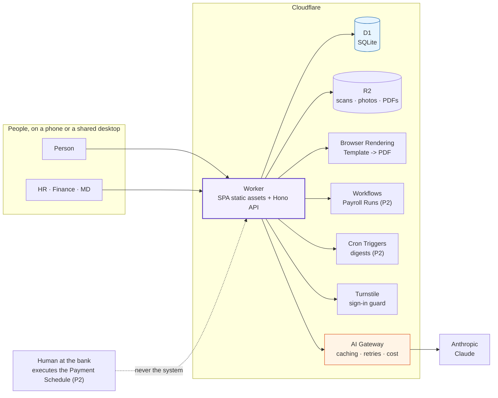
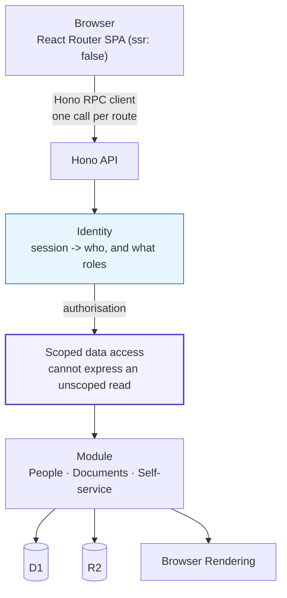
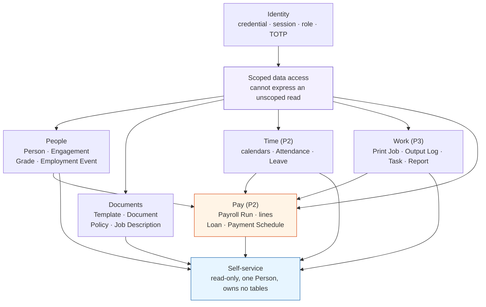
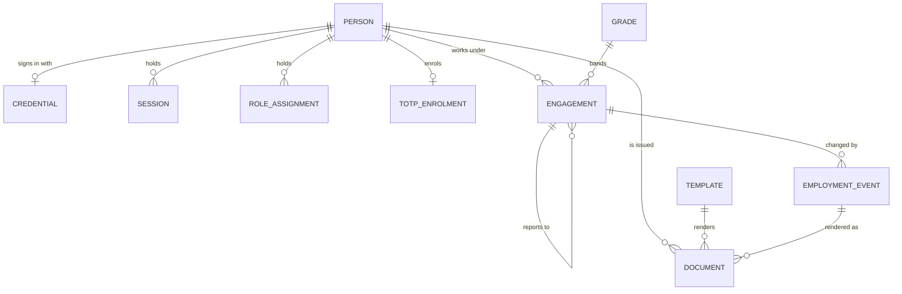

# System Design

The component view, request lifecycle, API contract and data model, in one place.
Builds on [`requirements.md`](./requirements.md) section 4 and [`architecture.md`](./architecture.md), which stay authoritative.
Read [`CONTEXT.md`](../CONTEXT.md) for the vocabulary.

## 1. System context

One Worker serves the SPA and the API, with everything else as Cloudflare bindings.
The system itself never moves money and never reaches an external service to let someone sign in.

Phase 1 uses only the Worker, D1, R2, Browser Rendering, Turnstile and AI Gateway.
Workflows and Cron arrive in phase 2.

## 2. Request lifecycle

Every request crosses the same four stages, in order.
The scoped data-access layer is the one place an unscoped read is structurally impossible.

- The SPA never calls the database directly; it calls one Hono endpoint per route.
- The Identity layer turns the session into a caller and a set of roles.
- The module handler reads and writes only through the scoped layer.
- One route means one batched D1 query, because the Lagos-to-Europe round trip is the budget.

### The two halves and the bridge

The front end and the API are two halves of one Worker, joined by a type-safe bridge.

**React Router SPA** is the front end.
The server sends a static HTML shell plus a JavaScript bundle once, and navigation happens in the browser with no page reloads (`ssr: false`).
Routes use `loader`s and `action`s; in SPA mode these run in the browser and become thin wrappers that call the API.
SPA mode is deliberate: server rendering would sit at or over the free plan's 10 ms CPU ceiling, and every page here is behind a login, so first-paint speed and SEO buy nothing.

**Hono** is the API framework.
It runs natively in the Workers isolate (no Node adapter) and provides routing and middleware on top of the web-standard `Request`/`Response`.
In this repo it is where Identity authorises the caller and every route hands off to the scoped data-access layer.

**Hono RPC** is the bridge.
The API exports its route types, and the front end imports them to get a fully type-checked client, so the path and response shape are checked at compile time.
Renaming a field in the API breaks the build rather than production.

Together: the SPA's client `loader` calls one Hono endpoint through the RPC client, and that endpoint does auth, one batched D1 query, and returns JSON.

## 3. Module map

Fixed by [`requirements.md`](./requirements.md) section 4.4.
Phase 1 builds the four highlighted modules; Time, Work and Pay come later.

Each module owns its tables and exposes intent, not rows.
`Pay` reads People, Time and Work and is read by nobody except the person's own payslip view.
`Self-service` owns no tables; it composes the others, scoped to one Person.

## 4. API design

One Worker, Hono on the API, React Router SPA in front of it.
The SPA uses Hono's RPC client, so request and response types are shared and a field change breaks the build instead of production.

### Conventions

- All endpoints live under `/api`, grouped by module.
- A session carries the caller; Identity resolves the caller and their roles before any module handler runs.
- Every read passes through the scoped data-access layer; there is no endpoint that can return an unscoped row.
- A self-service endpoint is always scoped to the authenticated Person, never parameterised by another Person's id.
- One endpoint returns one page's data in one batched query.
- Errors are structured JSON; expected domain failures return typed results, not generic 500s.

### Route surface (phase 1)

| Method | Path | Actor | Purpose |
|---|---|---|---|
| POST | `/api/identity/sign-in` | Person | phone + password -> session |
| POST | `/api/identity/sign-out` | Person | end the session |
| POST | `/api/identity/change-password` | Person | forced on first sign-in, then self-service |
| POST | `/api/identity/reset-password` | HR | set a new password in person |
| POST | `/api/identity/revoke-sessions` | HR | revoke on exit |
| POST | `/api/identity/change-phone` | HR | verified phone change (a credential) |
| POST | `/api/identity/enrol-totp` | Approving Role | enrol the authenticator |
| POST | `/api/identity/verify-totp` | Approving Role | confirm enrolment |
| POST | `/api/people/persons` | HR | create a Person |
| GET | `/api/people/persons/:id` | HR | read one Person |
| POST | `/api/people/engagements` | HR | open an Engagement |
| POST | `/api/people/engagements/:id/end` | HR | end with reason and last day |
| GET | `/api/people/grades` | MD | list Grades |
| POST | `/api/people/grades` | MD | create or edit a Grade |
| POST | `/api/people/events` | HR | record an Employment Event (draft) |
| POST | `/api/people/events/:id/commit` | HR | commit a draft event |
| POST | `/api/people/events/:id/approve` | MD, Finance | approve a money event |
| GET | `/api/documents/templates` | HR | list Templates |
| POST | `/api/documents/templates` | HR | create or version a Template |
| POST | `/api/documents/issue` | HR | render a Document to PDF from a Template |
| POST | `/api/documents/:id/attach-scan` | HR | attach a wet-signed scan, Issued -> Signed |
| GET | `/api/documents/outstanding` | HR | every unsigned Document |
| POST | `/api/documents/policies` | HR | publish a Policy |
| POST | `/api/documents/job-descriptions` | HR | publish a Job Description |
| GET | `/api/self/profile` | Person | own profile |
| GET | `/api/self/engagements` | Person | current and historical Engagements |
| GET | `/api/self/events` | Person | own committed Events, never drafts |
| GET | `/api/self/documents` | Person | own outstanding and signed Documents |
| GET | `/api/self/reference` | Person | own Job Description and applicable Policies |

The scan-verification AI feature (phase 1) rides on `attach-scan`: Claude proposes type, signature and date, and only a human confirmation commits the Signed transition.

## 5. Data model

[`requirements.md`](./requirements.md) section 4.1 fixes the entities and their ownership.
The storage conventions in [`tech-stack.md`](./tech-stack.md) fix the types.
The table-level shape below is a proposed concrete rendering of those two, to be settled in the first migration.
Money is an integer of whole naira, dates are TEXT ISO 8601, booleans are INTEGER 0/1, enums are TEXT with a CHECK, and files are R2 keys.

### person

| Column | Type | Notes |
|---|---|---|
| id | TEXT PK | UUID |
| name | TEXT NOT NULL | |
| phone | TEXT NOT NULL UNIQUE | the username, a credential |
| photo_key | TEXT | R2 key, nullable |
| bank_account | TEXT | verified by HR, not the system |
| next_of_kin | TEXT | |
| guarantor | TEXT | |
| created_at | TEXT NOT NULL | ISO 8601 |

No NIN column exists, and none will.

### credential

| Column | Type | Notes |
|---|---|---|
| person_id | TEXT PK, FK person | one credential per Person |
| password_hash | TEXT NOT NULL | PBKDF2-SHA256 |
| salt | TEXT NOT NULL | |
| iterations | INTEGER NOT NULL | OWASP-recommended |
| must_change | INTEGER NOT NULL | 1 until first sign-in changes it |
| updated_at | TEXT NOT NULL | |

### session

| Column | Type | Notes |
|---|---|---|
| id | TEXT PK | |
| person_id | TEXT NOT NULL, FK person | |
| created_at | TEXT NOT NULL | |
| last_seen_at | TEXT NOT NULL | idle timeout basis |
| revoked | INTEGER NOT NULL | 1 on exit |

No persistent-sign-in flag exists, by design.

### role_assignment

| Column | Type | Notes |
|---|---|---|
| id | TEXT PK | |
| person_id | TEXT NOT NULL, FK person | |
| role | TEXT NOT NULL CHECK | HR, Finance or MD |
| granted_at | TEXT NOT NULL | |
| revoked_at | TEXT | nullable |

One Person can hold several roles at Talabon's size; they are recorded separately so they can be tightened later.

### totp_enrolment

| Column | Type | Notes |
|---|---|---|
| person_id | TEXT PK, FK person | |
| secret | TEXT NOT NULL | |
| confirmed_at | TEXT | null until the role holder confirms |

### grade

| Column | Type | Notes |
|---|---|---|
| id | TEXT PK | |
| title | TEXT NOT NULL UNIQUE | |
| salary_min | INTEGER NOT NULL | whole naira |
| salary_max | INTEGER NOT NULL | whole naira |
| missed_day_deduction | INTEGER NOT NULL | whole naira |
| premium_per_day | INTEGER NOT NULL | whole naira |

### engagement

| Column | Type | Notes |
|---|---|---|
| id | TEXT PK | |
| person_id | TEXT NOT NULL, FK person | |
| kind | TEXT NOT NULL CHECK | only `permanent` is built (ADR 0010) |
| job_title | TEXT NOT NULL | |
| grade_id | TEXT NOT NULL, FK grade | |
| salary | INTEGER NOT NULL | must fall inside the Grade's band |
| reports_to_engagement_id | TEXT, FK engagement | the reporting line |
| leave_entitlement | INTEGER NOT NULL | per Engagement, not per Grade |
| loan_ceiling | INTEGER NOT NULL | per Engagement |
| started_at | TEXT NOT NULL | |
| ended_at | TEXT | null while active |
| end_reason | TEXT | set with ended_at |

The one-active-Engagement invariant is enforced at the scoped layer, not just in the UI.

### employment_event

| Column | Type | Notes |
|---|---|---|
| id | TEXT PK | |
| engagement_id | TEXT NOT NULL, FK engagement | |
| kind | TEXT NOT NULL CHECK | confirmation, promotion, grade_change, salary_change, sanction, suspension, exit |
| state | TEXT NOT NULL CHECK | draft, committed, abandoned |
| effective_date | TEXT NOT NULL | |
| terms | TEXT NOT NULL | the changed terms, structured |
| committed_by | TEXT, FK person | |
| committed_at | TEXT | |

A draft is invisible to the subject and ignored by anything reading terms in force.
Committing is the transition that makes it real.

### template

| Column | Type | Notes |
|---|---|---|
| id | TEXT PK | |
| name | TEXT NOT NULL | |
| version | INTEGER NOT NULL | UNIQUE with name |
| body | TEXT NOT NULL | HTML, rendered to PDF |
| created_at | TEXT NOT NULL | |

### document

| Column | Type | Notes |
|---|---|---|
| id | TEXT PK | |
| person_id | TEXT NOT NULL, FK person | |
| engagement_id | TEXT, FK engagement | where applicable |
| template_id | TEXT NOT NULL, FK template | |
| template_version | INTEGER NOT NULL | the version it was rendered from |
| event_id | TEXT, FK employment_event | where it renders an event |
| state | TEXT NOT NULL CHECK | issued, signed |
| scan_key | TEXT | R2 key, set when signed |
| signed_date | TEXT | the date on the page, not the upload date |
| issued_at | TEXT NOT NULL | |
| proposed_type | TEXT | model proposal, never shown to the subject |
| proposed_has_signature | INTEGER | model proposal |
| proposed_date | TEXT | model proposal |
| proposed_by_model | TEXT | provenance |
| human_confirmed | INTEGER | a human, not the model, commits Signed |

The proposal columns are the draft-and-committed seam for the AI feature: the model proposes, a human confirms.

### policy

| Column | Type | Notes |
|---|---|---|
| id | TEXT PK | |
| name | TEXT NOT NULL | |
| version | INTEGER NOT NULL | UNIQUE with name |
| body | TEXT NOT NULL | |
| scope | TEXT NOT NULL CHECK | everyone, grade, title |
| scope_value | TEXT | grade id or job title |
| created_at | TEXT NOT NULL | |

### job_description

| Column | Type | Notes |
|---|---|---|
| id | TEXT PK | |
| title | TEXT NOT NULL | |
| version | INTEGER NOT NULL | UNIQUE with title |
| body | TEXT NOT NULL | |
| created_at | TEXT NOT NULL | |

## 6. Model walkthrough

The whole model answers one question about every fact: does it survive a change in how the Person works for Talabon?
Facts that survive belong to the Person; facts about one period of working belong to an Engagement.

Concrete example to anchor the rest:

> Ade joins in January 2022 as Machine Operator at Grade 4, leaves in 2023, and is rehired in 2025 as Production Manager at Grade 6.

The model gives Ade one `person` row - same phone, bank and next of kin, and any unpaid Loan survives - and two `engagement` rows.
One covers 2022-2023 as Operator at Grade 4; the other covers 2025- as Manager at Grade 6.
The terms, events and letters belong to the relevant Engagement, never to Ade directly.

### Person and what hangs off it

`person` is the durable core: one row per human, forever.
The phone number is the unique username, a credential rather than contact data, and there is deliberately no NIN column.

- `credential` (1:1) - the password. `person_id` is the primary key, so one credential per Person. It stores hash, salt, iterations and a `must_change` flag that forces the first-sign-in change.
- `session` (1:N) - one row per active login. `revoked` and `last_seen_at` drive expiry. No "keep me signed in" flag exists, by design (shared desktops).
- `role_assignment` (1:N) - which Approving Roles a Person holds. One Person can hold several at Talabon's size; `revoked_at` ends a role without deleting history.
- `totp_enrolment` (1:1) - the authenticator secret. `confirmed_at` is null until enrolment completes, which gates "must enrol before exercising the role".

The `loan` (phase 2) hangs off `person`, not `engagement`, so a balance survives Ade leaving and follows her into the 2025 rehire.

### Engagement and its terms

`engagement` holds the terms in force. Its important columns:

- `kind` - only `permanent` is built, but the column exists so Casual does not force a rewrite later.
- `grade_id` - the Grade whose band the `salary` must sit inside.
- `reports_to_engagement_id` - the reporting line, a self-reference to another Engagement (a Manager's). "Manager" is not a separate entity; it is a Person referenced as someone's report-to.
- `leave_entitlement` and `loan_ceiling` - on the Engagement, not the Grade, so two people on one Grade can hold different terms.
- `started_at`, `ended_at`, `end_reason` - the lifecycle. At most one active Engagement per Person is enforced at the data-access layer.

`grade` is standalone reference data: salary band, missed-day deduction and premium, all whole-naira integers.
Engagements point to it; it points at nothing.

### The event is the source of truth

`employment_event` hangs off `engagement` and is the pivotal entity.
A promotion, grade change, sanction, suspension or exit is recorded here, and letters are rendered from it, not the other way round.

- `kind` - confirmation, promotion, grade_change, salary_change, sanction, suspension, exit.
- `state` - draft, committed or abandoned. A draft is invisible to its subject and ignored by payroll; committing makes it real.
- `terms` - the changed facts, held as structured data so payroll can read them.

Ade's promotion is one row (kind=promotion, new grade and salary in `terms`).
Her promotion letter renders from the same row, so the letter and the payslip can never disagree.

### Documents: rendered, versioned, signed

`document` is the artifact and the join-heavy node:

- `person_id` and optional `engagement_id` - who it is for, and under which Engagement it was issued.
- `template_id` and `template_version` - which version produced it. A 2022 letter reproduces exactly in 2029 because the version is frozen on the row.
- `event_id` - the Employment Event it renders, when it renders one.
- `state` - issued to signed. Only attaching a wet-signed scan moves it; `signed_date` is the date on the page, not the upload date.
- `proposed_*` and `human_confirmed` - the AI draft-and-commit seam. Claude proposes; a human confirms; the proposal is never shown to the subject.

`template` is standalone: name plus version (unique together) plus the HTML body.

### Reference material: deliberately not attached to a Person

`policy` and `job_description` have no relationship to `person`.
A Policy is published to an audience (everyone, a Grade, or a title), and a Job Description to a title.
That is what distinguishes them from a Document, and why they sit off the ER diagram with no line to Person.
Where proof of reading is needed, a `document` is issued from them and signed in the ordinary way.

### What was left out

Two absences are decisions, not oversights:

- No foreign key between the calendars and `attendance` (phase 2). `public_holiday` and `operating_day` are standalone, because linking either to `attendance` would be the first step toward collapsing the Expected Day and Operating Day calendars, which the ADRs forbid.
- No commercial columns on `print_job` (phase 3). A Print Job exists only to check output claims against an ordered quantity - no customer, price, quote or invoice.

### The two loads to remember

- Ownership direction: Loan to Person (survives departure); Leave entitlement and loan ceiling to Engagement (per terms, not per Grade); salary to Engagement (band-checked against Grade).
- State machines carry the integrity: an Event's draft to committed, and a Document's issued to signed, are where the human-commits rule physically lives.

## 7. What phase 2 and 3 add

Phase 2 brings Attendance, Leave, Loan, Payroll Run and Payment Schedule tables, plus a Workflow that computes, pauses for human approval, and freezes the Run.
Phase 3 brings Print Job, Output Log, Task, Report and Performance Review tables.
Those entities are already specified in [`requirements.md`](./requirements.md) section 4.1 and are deliberately not re-designed here.
